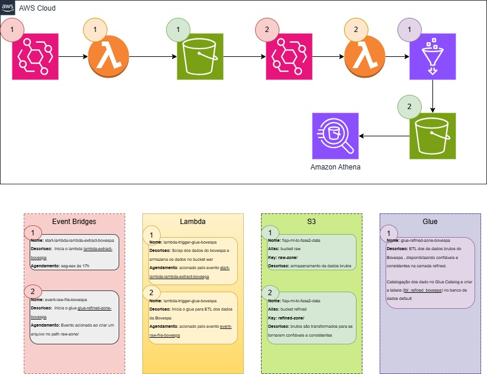

# Projeto Tech Chalenge Fase-2
---
## 📌 Índice

- [📝 Sobre o Projeto](#-sobre-o-projeto)
- [🛠 Tecnologias e Ferramentas](#-tecnologias-e-ferramentas-utilizadas)
- [🧱 Arquitetura da Solução](#-arquitetura-da-solucao)
- [🚀 Como Configurar e Executar o Projeto](#como-Configurar-e-Executar-o-Projeto)
- [📖 Catálogo de Dados e Metadados](#Catálogo-de-Dados-e-Metadados)
- [🗂️ Estrutura de diretorios](#Estrutura-de-diretorios)
- [🎥 Vídeo Demonstrativo](#-vídeo-demonstrativo)
- [🤝 Desenvolvedores](#-desenvolvedores)
- [⚖️ Licença](#-Licença)
---


## 📝 Sobre o Projeto
Este repositório contém a implementação do `Tech Challenge Fase 2 da Pós-Graduação em Machine Learning`, focado na construção de um pipeline de dados completo para ingestão, processamento e análise de dados do pregão da **B3 (Bovespa)**. A arquitetura é totalmente serverless, utilizando serviços AWS como `S3`, `Glue`, `Lambda` e `Athena`, seguindo as melhores práticas de Big Data.

O projeto aborda o desafio de extrair dados financeiros de uma fonte externa, transformá-los em um formato otimizado para análise e disponibilizá-los para consultas eficientes, garantindo escalabilidade, resiliência e custo-benefício.

### ✨ Funcionalidades e Requisitos Implementados
O pipeline de dados foi desenvolvido para atender aos seguintes requisitos obrigatórios:

- **Extração de Dados (Scraping):** Realiza o scraping de dados do pregão do site oficial da B3.

- **Ingestão na Camada Raw:** Os dados brutos são ingeridos no Amazon S3 em formato Parquet, com particionamento diário para otimização de consultas.

- **Orquestração com Lambda:** Um evento no S3 (ao adicionar novos dados brutos) aciona uma função AWS Lambda.

- **Disparo de Job ETL (Glue):** A função Lambda (desenvolvida em Python) é responsável por iniciar um job de ETL (Extract, Transform, Load) no AWS Glue.

    - **Transformações no AWS Glue:** O job Glue, configurado visualmente, executa as seguintes transformações obrigatórias:

        - **Agrupamento e Sumarização:** Realiza agrupamentos numéricos com sumarização, contagem ou soma.

        - **Renomeação de Colunas:** Renomeia duas colunas existentes, além das colunas de agrupamento.

        - **Cálculo com Datas:** Executa um cálculo envolvendo campos de data (ex: duração, comparação, diferença entre datas).

    - **Armazenamento na Camada Refined:** Os dados processados e refinados pelo job Glue são salvos no S3 em formato **Parquet**, em uma pasta `refined`, particionados por data e pelo nome/abreviação da ação do pregão.

    - **Catalogação Automática (Glue Catalog):** O job Glue cataloga automaticamente os dados no AWS Glue Data Catalog, criando uma tabela no banco de dados padrão.

- **Disponibilidade no Athena:** Os dados refinados estão disponíveis e legíveis para consultas no Amazon Athena.

## 🛠 Tecnologias e Ferramentas
|Ferramenta| Categoria| Utilização no Projeto|
|----------|----------|----------|
|🐍 Python 3.13         | Linguagem de Programação |Linguagem principal para as funções Lambda e o script PySpark.|
|✨ PySpark Framework   | Framework de Processamento de Dados |utilizado no AWS Glue para processamento distribuído dos dados.|
|🐑 AWS Lambda          | Serviço AWS |Orquestração do pipeline, executando a extração de dados e o acionamento do job Glue.|
|🧩 AWS Glue            | Serviço AWS |Serviço central de ETL, responsável pela transformação e catalogação dos dados.|
|🪣 Amazon S3           | Serviço AWS |Data Lake para armazenamento dos dados nas camadas raw e refined.|
|🔍 Amazon Athena       | Serviço AWS |Serviço de consulta interativa para análise dos dados refinados via SQL.|
|🌉 AWS EventBridge     | Serviço AWS |Agendamento da extração de dados e gatilho para o início do ETL.|
---

## 🧱 Arquitetura da Solução
O pipeline foi desenhado para ser robusto, escalável e de baixo custo, operando de forma totalmente serverless.Abaixo, um diagrama visual do fluxo de dados:

 

O fluxo de dados ocorre da seguinte maneira:

1. **📅 Agendamento:** Uma regra no **Amazon EventBridge** aciona a função Lambda de extração todos os dias úteis às 17h.
2. **📥 Extração (Camada Raw):** A função **Lambda** `lambda-extract-bovespa` executa um script que extrai os dados do pregão da B3. Os dados brutos são salvos no Amazon S3, na camada `raw-zone`, em formato Parquet e particionados por data (`/ano/mês/dia`).
3. **🔔 Gatilho do ETL:** A criação de um novo objeto no bucket S3 dispara um evento, capturado por outra regra no **EventBridge**, que por sua vez aciona a função **Lambda** `lambda-trigger-glue-bovespa`.
4. **⚙️ Processamento (Camada Refined):** A Lambda de trigger inicia o **Job do AWS Glue** `glue-refined-zone-bovespa`. Este job lê os dados brutos da camada raw-zone, aplica transformações como limpeza, renomeação de colunas, cálculos e agregações, e salva os dados processados na camada `refined-zone` do S3.
5. **📚 Catalogação (Glue Data Catalog):** Ao final da execução, o job do Glue atualiza o **Data Catalog**, criando e/ou atualizando as partições da tabela de dados refinados.
6. **📊 Análise (Athena):** Os dados refinados e catalogados ficam disponíveis para consulta no **Amazon Athena**, permitindo que analistas e cientistas de dados explorem as informações utilizando sintaxe SQL padrão.
---

## 🚀 Como Configurar e Executar o Projeto
Para replicar este projeto em sua própria conta AWS, siga os passos abaixo.

### Pré-requisitos
 - Conta na AWS com permissões para criar recursos (IAM, S3, Lambda, Glue, EventBridge, Athena).
 - AWS CLI configurado em sua máquina local.
 - Python 3.13 instalado.
 - Git instalado.
 - Conhecimento básico sobre os serviços AWS mencionados.

### Passos para o Deploy
1. **Clone o Repositório:**
```bash
git clone https://github.com/seu-usuario/seu-repositorio.git
cd seu-repositorio
```

2. **Crie o Bucket S3:**
    - Crie um bucket no Amazon S3 que será usado como Data Lake. Ex: `fiap-ml-tc-fase2-data-SEUNOME`.
    - Dentro do bucket, crie as pastas `raw-zone/` e `refined-zone/`.

3. **Faça o Deploy dos Recursos:**
    - **Funções Lambda:** Crie duas funções Lambda (`lambda-extract-bovespa e lambda-trigger-glue-bovespa`) e faça o upload dos respectivos códigos-fonte localizados no diretório `src/lambda`. Configure as variáveis de ambiente e permissões (IAM Roles) necessárias.
    - **Job do Glue:** Crie um novo job no AWS Glue (`glue-refined-zone-bovespa`), aponte para o script `glue-refined-zone-bovespa.py` e configure os parâmetros do job, como o Role do IAM e as bibliotecas adicionais (`awswrangler`).
    - **Regras do EventBridge:**
        1. Navegue até os diretórios de CloudFormation:
            - Os templates de CloudFormation estão localizados em src/event-bridge/.
        2. Implante os Stacks:
            - Utilize o AWS CLI para criar ou atualizar os stacks do CloudFormation. Exemplo:
            ```bash
            aws cloudformation deploy \
            --template-file src/event-bridge/start-lambda-lambda-extract-bovespa/start-lambda-lambda-extract-bovespa.json \
            --stack-name StartLambdaExtractBovespaStack \
            --capabilities CAPABILITY_NAMED_IAM # Necessário para criar IAM Roles
            ```
            ```bash
            aws cloudformation deploy \
            --template-file src/event-bridge/create-event-raw-file-bovespa/create-event-raw-file-bovespa.json \
            --stack-name CreateEventRawFileBovespaStack \
            --capabilities CAPABILITY_NAMED_IAM
            ```
    *Lembre-se de atualizar os ARNs dos recursos (Lambda e S3) para corresponder aos da sua conta*

4. **Execute o Pipeline:**
    - **Execução Manual**
        - Para iniciar o fluxo, você pode executar a Lambda `lambda-extract-bovespa` manualmente pela primeira vez ou aguardar o agendamento do EventBridge.
        - Após a execução, os dados brutos aparecerão na `raw-zone`. Isso irá disparar o restante do pipeline automaticamente.
    - **Execução Automatica**
        - **Extração Diária:** O EventBridge inicia a Lambda `lambda-extract-bovespa` agendada para todos os dias às 17h.
        - **ETL Automático:** A criação de novos arquivos Parquet na Raw Zone do S3 (pela Lambda de extração) acionará a `lambda-trigger-glue-bovespa`, que por sua vez iniciará o job Glue de ETL.

5. **Consulte os Dados no Athena:**
    - Após a conclusão do job do Glue, navegue até o Amazon Athena.
    - Selecione o banco de dados `db_default` (ou o que foi configurado no script).
    - Execute uma consulta na tabela `tbl_refined_bovespa` para visualizar os dados processados.
    ```sql  
    SELECT * FROM "db_default"."tbl_refined_bovespa" LIMIT 10;
    ```

## 📖 Catálogo de Dados e Metadados
Os dados processados pelo pipeline são armazenados e catalogados na tabela `tbl_refined_bovespa`. Abaixo estão os detalhes do esquema dessa tabela, conforme definido no script do Glue.

### Esquema da Tabela
|Coluna | Tipo de Dado|  Descrição|
|----|----|----|
nom_empresa                             | string | Nome da empresa associada à ação.|
qtd_registros                           | bigint | Contagem total de registros de ações para a |empresa naquele dia.
qtd_acao                                | bigint | Quantidade de códigos de ação distintos para a |empresa.
qtd_tipos_acao                          | bigint | Quantidade de tipos de ação distintos (ON, PN, |etc.).
qtd_teorica_acumulada                   | bigint | Soma da quantidade teórica de todas as ações da |empresa.
qtd_teorica_max                         | bigint | Quantidade teórica máxima entre as ações da |empresa.
qtd_teorica_min                         | bigint | Quantidade teórica mínima entre as ações da |empresa.
avg_participacao_setor_total            | double | Média de participação da empresa no setor.|
avg_participacao_setor_acumulada_total  | double | Média de participação acumulada da empresa no |setor.
qtd_dias_atraso                         | int | Diferença em dias entre a data de referência e a |data do processamento.
data_ref                                | date | Data de referência do pregão da B3.|
dth_etl_processamento                   | timesta| mp Data e hora em que o registro foi processado |pelo ETL.

### Chaves de Partição
A tabela é particionada para otimizar as consultas e o gerenciamento dos dados no S3.

| Chave de Partição | Tipo de Dado| Descrição|
|----|----|----|
|year       |int    | Ano da data de referência.|
|month      |int    | Mês da data de referência.|
|day        |int    | Dia da data de referência.|
|nom_setor  |string | Setor de atuação da empresa.|


### 🗂️ Estrutura de diretorios

O projeto está organizado da seguinte forma para facilitar a navegação e o entendimento:

``` text
.
├── .gitignore
├── README.md
├── docs
│   └── imgs
│       └── api_fase2.jpg
├── notebook
│   └── notebook_etl_glue.ipynb     # Notebook para exploração e análise dos dados.
└── src
    ├── event-bridge                # Configurações das regras do EventBridge (IaC)
    │   ├── create-event-raw-file-bovespa.json
    │   └── start-lambda-lambda-extract-bovespa.json
    ├── glue                        # Scripts e configurações do AWS Glue
    │   └── glue-refined-zone-bovespa
    │       ├── glue-refined-zone-bovespa.json
    │       └── glue-refined-zone-bovespa.py
    └── lambda                      # Código-fonte das funções Lambda
        ├── lambda-extract-bovespa
        │   └── lambda_function.py
        └── lambda-trigger-glue-bovespa
            └── lambda_function.py
```
---

## 🎥 Vídeo Demonstrativo
Assista ao vídeo explicativo do projeto e seu desenvolvimento em funcionamento: https://sssssssssssss

---

## 🤝 Desenvolvedores
Este projeto foi desenvolvido com a colaboração dos seguintes membros:
|Nome | RM | Github|
|----|----|----|
|Lucas Felipe de Jesus Machado      | RM364306 | [link](https://github.com/lfjmachado)
|Antônio Teixeira Santana Neto      | RM364480 | [link](https://github.com/antonioteixeirasn)
|Gabriela Moreno Rocha dos Santos   | RM364538 | [link](https://github.com/gabrielaMSantos)
|Erik Douglas Alves Gomes           | RM364379 | [link](https://github.com/Erik-DAG)
|Leonardo Fernandes Soares          | RM364648 | [link](https://github.com/leferso)

## ⚖️ Licença
Este projeto está sob a licença **MIT**. Veja o arquivo [LICENSE](LICENSE) para mais detalhes.